# Component Dependency Analysis

## Overview
This document provides a comprehensive analysis of the component ecosystem in the Pinnlo V2 application, showing how components relate to each other, their dependencies, and communication patterns.

## Key Component Files Analyzed

### 1. ContentArea.tsx
**Location**: `src/components/workspace/ContentArea.tsx`

**Purpose**: Displays and manages cards within a blueprint workspace

**Dependencies**:
- **Components**: 
  - `MasterCard` - For rendering individual cards
- **Hooks**: 
  - `useCards` - For card CRUD operations
- **External**: 
  - React (useState, useEffect, forwardRef, useImperativeHandle)
  - lucide-react icons

**Props Received**:
- `blueprint?: Blueprint` - Current blueprint context
- `strategyId?: string` - Strategy identifier
- `ref` - ForwardedRef for parent component communication

**Communication**:
- **Upward**: Exposes `createCard` method via ref to parent components
- **Downward**: Passes card data and handlers to MasterCard components
- **State Management**: Local state for available cards

**API Calls**: None directly (uses useCards hook)

### 2. BlueprintNavigation.tsx
**Location**: `src/components/workspace/BlueprintNavigation.tsx`

**Purpose**: Sidebar navigation for switching between blueprints

**Dependencies**:
- **Components**: None
- **Hooks**: None
- **External**: React

**Props Received**:
- `blueprints: Blueprint[]` - List of available blueprints
- `activeBlueprint: string` - Currently selected blueprint ID
- `onSelectBlueprint: (id: string) => void` - Callback for blueprint selection

**Communication**:
- **Upward**: Notifies parent of blueprint selection via callback
- **State Management**: Stateless component

**API Calls**: None

### 3. StrategyCreator.tsx
**Location**: `src/components/strategy-creator/StrategyCreator.tsx`

**Purpose**: Multi-step modal for AI-powered strategy card generation

**Dependencies**:
- **Components**:
  - `CreatorSidebar` - Step navigation
  - `UnifiedContextSelector` - Step 1 component
  - `ContextSummaryReview` - Step 2 component
  - `TargetBlueprintSelector` - Step 3 component
  - `GeneratedCardsReview` - Step 4 component
- **Hooks**: None directly
- **External**: 
  - React (useState, useEffect)
  - lucide-react icons

**Props Received**:
- `isOpen: boolean` - Modal visibility
- `onClose: () => void` - Close handler

**Communication**:
- **State Management**: Complex local state for session management
- **API Calls**: 
  - `/api/strategy-creator/session` - Session management
  - Session state updates

**Session State Structure**:
```typescript
{
  id: string | null
  strategyId: string | null
  strategyName: string | null
  currentStep: number
  completedSteps: number[]
  selectedBlueprintCards: any[]
  selectedIntelligenceCards: any[]
  selectedIntelligenceGroups: any[]
  intelligenceGroupCards: any[]
  contextSummary: string | null
  targetBlueprint: string | null
  generationOptions: {
    count: number
    style: 'comprehensive' | 'focused' | 'innovative'
  }
  generatedCards: any[]
}
```

### 4. IntelligenceBank.tsx
**Location**: `src/components/intelligence-bank/IntelligenceBank.tsx`

**Purpose**: Modal interface for managing intelligence cards

**Dependencies**:
- **Components**:
  - `IntelligenceProfile`
  - `IntelligenceCardList`
  - `IntelligenceCardEditor`
  - `IntelligenceGroups`
  - `BulkActionsToolbar`
  - `CardGroupSelector`
  - `AutomationDashboard`
- **Hooks**:
  - `useIntelligenceCardCounts`
  - `useCreateIntelligenceCard`
  - `useUpdateIntelligenceCard`
  - `useIntelligenceCardActions`
  - `useIntelligenceGroups`
  - `useTextProcessing`
- **External**: 
  - React (useState, useEffect)
  - Extensive lucide-react icon set

**Props Received**:
- `isOpen: boolean` - Modal visibility
- `onClose: () => void` - Close handler

**Communication**:
- **State Management**: Complex local state for:
  - Category selection
  - Search/filter states
  - Card selection
  - View modes
- **Custom Events**: Listens for `intelligence-bank-create-card` events
- **API Calls**: Via hooks for all card operations

### 5. DevelopmentBankModal.tsx
**Location**: `src/components/development-bank/DevelopmentBankModal.tsx`

**Purpose**: Modal for bridging strategy to development execution

**Dependencies**:
- **Components**:
  - `DevelopmentBank`
  - `SpecificationDisplay`
- **Hooks**:
  - `useAuth`
  - `useStrategies`
- **External**:
  - React (useState)
  - lucide-react icons
  - supabase client

**Props Received**:
- `isOpen: boolean` - Modal visibility
- `onClose: () => void` - Close handler
- `strategyId?: string` - Optional initial strategy

**Communication**:
- **State Management**: Local state for:
  - Strategy selection
  - Generation states (spec, test, tasks)
  - Active tab
- **API Calls**:
  - `/api/development-bank/generate-spec`
  - `/api/development-bank/generate-tests`
  - `/api/development-bank/generate-tasks`

### 6. MasterCard.tsx
**Location**: `src/components/cards/MasterCard.tsx`

**Purpose**: Universal card component for all blueprint types

**Dependencies**:
- **Components**:
  - `TagEditor`
  - `RelationshipEditor`
  - `BlueprintFields`
- **Hooks**: None directly
- **External**:
  - React (useState, useEffect)
  - lucide-react icons
  - supabase client (for AI enhancement)

**Props Received**:
- `cardData: CardData` - Card information
- `onUpdate: (updatedCard: Partial<CardData>) => Promise<void> | void`
- `onDelete: () => void`
- `onDuplicate: () => void`
- `onAIEnhance: () => void`
- `availableCards?: Array<{...}>` - For relationship selection

**Communication**:
- **Upward**: Callbacks for all card operations
- **State Management**: Local state for:
  - Edit mode
  - Expanded state
  - Pin state
  - Edit data
- **API Calls**: 
  - Supabase Edge Function `enhance-field` for AI enhancement

## Component Dependency Graph

```mermaid
graph TD
    %% Page Level
    HomePage[HomePage - app/page.tsx]
    WorkspacePage[WorkspacePage - workspace/page.tsx]
    
    %% Container Components
    MainContent[MainContentContainer]
    Sidebar[SidebarContainer]
    StrategiesGrid[StrategiesGrid]
    
    %% Workspace Components
    BlueprintNav[BlueprintNavigation]
    ContentArea[ContentArea]
    PageController[PageController]
    BlueprintManager[BlueprintManager]
    ExecutiveSummary[ExecutiveSummary]
    QuickAdd[QuickAdd]
    StrategyTools[StrategyTools]
    
    %% Card Components
    MasterCard[MasterCard]
    TagEditor[TagEditor]
    RelationshipEditor[RelationshipEditor]
    BlueprintFields[BlueprintFields]
    
    %% Modal Components
    StrategyCreator[StrategyCreator]
    IntelligenceBank[IntelligenceBank]
    DevelopmentBank[DevelopmentBankModal]
    
    %% Intelligence Bank Sub-components
    IntelligenceProfile[IntelligenceProfile]
    IntelligenceCardList[IntelligenceCardList]
    IntelligenceCardEditor[IntelligenceCardEditor]
    IntelligenceGroups[IntelligenceGroups]
    
    %% Strategy Creator Steps
    UnifiedContextSelector[UnifiedContextSelector]
    ContextSummaryReview[ContextSummaryReview]
    TargetBlueprintSelector[TargetBlueprintSelector]
    GeneratedCardsReview[GeneratedCardsReview]
    
    %% Hooks
    useStrategies[useStrategies Hook]
    useCards[useCards Hook]
    useIntelligenceCards[useIntelligenceCards Hooks]
    useAuth[useAuth Hook]
    
    %% Relationships
    HomePage --> MainContent
    HomePage --> Sidebar
    HomePage --> useStrategies
    
    MainContent --> StrategiesGrid
    StrategiesGrid --> useStrategies
    
    WorkspacePage --> BlueprintNav
    WorkspacePage --> ContentArea
    WorkspacePage --> PageController
    WorkspacePage --> BlueprintManager
    WorkspacePage --> ExecutiveSummary
    WorkspacePage --> QuickAdd
    WorkspacePage --> StrategyTools
    
    ContentArea --> MasterCard
    ContentArea --> useCards
    
    MasterCard --> TagEditor
    MasterCard --> RelationshipEditor
    MasterCard --> BlueprintFields
    
    StrategyCreator --> UnifiedContextSelector
    StrategyCreator --> ContextSummaryReview
    StrategyCreator --> TargetBlueprintSelector
    StrategyCreator --> GeneratedCardsReview
    
    IntelligenceBank --> IntelligenceProfile
    IntelligenceBank --> IntelligenceCardList
    IntelligenceBank --> IntelligenceCardEditor
    IntelligenceBank --> IntelligenceGroups
    IntelligenceBank --> useIntelligenceCards
    
    DevelopmentBank --> useAuth
    DevelopmentBank --> useStrategies
    
    style HomePage fill:#f9f,stroke:#333,stroke-width:4px
    style WorkspacePage fill:#f9f,stroke:#333,stroke-width:4px
    style StrategyCreator fill:#9ff,stroke:#333,stroke-width:2px
    style IntelligenceBank fill:#9ff,stroke:#333,stroke-width:2px
    style DevelopmentBank fill:#9ff,stroke:#333,stroke-width:2px
```



## Communication Patterns

### 1. **Parent-Child Communication**
- **Props Down**: Parents pass data and callbacks to children
- **Events Up**: Children communicate via callback functions
- **Ref Forwarding**: ContentArea exposes methods via ref

### 2. **Hook-Based State Management**
- `useStrategies`: Global strategy management
- `useCards`: Card CRUD operations per strategy
- `useIntelligenceCards`: Intelligence card management
- `useAuth`: Authentication state

### 3. **API Communication**
- **REST APIs**: 
  - `/api/cards` - Card operations
  - `/api/strategy-creator/*` - AI generation
  - `/api/development-bank/*` - Dev asset generation
  - `/api/executive-summary*` - Summary generation
- **Supabase Direct**: 
  - Authentication
  - Database queries
  - Edge Functions

### 4. **Event System**
- Custom DOM events (e.g., `intelligence-bank-create-card`)
- Used for cross-component communication without prop drilling

## Key Integration Points

### 1. **Strategy Context Flow**
```
HomePage → StrategiesGrid → Strategy Selection → WorkspacePage
                                                       ↓
                                                  ContentArea
                                                       ↓
                                                  MasterCard
```

### 2. **Modal Integration**
- All major modals (StrategyCreator, IntelligenceBank, DevelopmentBank) are independent
- They receive minimal props (isOpen, onClose) and manage their own state
- Communication with main app via hooks and APIs

### 3. **Card Data Flow**
```
Database → useCards Hook → ContentArea → MasterCard
            ↑                               ↓
            └───────── Updates ─────────────┘
```

### 4. **Intelligence Card Flow**
```
IntelligenceBank → useIntelligenceCards → API → Database
        ↓
  Text Processing
        ↓
  Card Creation
```

## Component Responsibilities

### Container Components
- **HomePage**: Root dashboard layout
- **WorkspacePage**: Strategy workspace orchestration
- **MainContentContainer**: Strategy list wrapper
- **SidebarContainer**: Dashboard tools/help

### Display Components
- **MasterCard**: Universal card renderer
- **BlueprintNavigation**: Blueprint selector
- **StrategiesGrid**: Strategy card grid

### Feature Components
- **StrategyCreator**: AI-powered card generation
- **IntelligenceBank**: Intelligence management system
- **DevelopmentBankModal**: Development asset generation

### Utility Components
- **QuickAdd**: Quick card creation
- **ExecutiveSummary**: AI summary generation
- **PageController**: Workspace controls

## Best Practices Observed

1. **Separation of Concerns**: Each component has a single, well-defined purpose
2. **Hook Abstraction**: Business logic separated into custom hooks
3. **Prop Minimization**: Components receive only necessary props
4. **State Localization**: State kept as local as possible
5. **Type Safety**: TypeScript interfaces for props and data
6. **Error Handling**: Try-catch blocks in async operations
7. **Loading States**: Proper loading indicators
8. **Ref Usage**: Strategic use of refs for imperative operations

## Areas for Potential Improvement

1. **State Management**: Consider Redux/Zustand for complex state
2. **Error Boundaries**: Add error boundaries for modal components
3. **Code Splitting**: Lazy load heavy modal components
4. **Event System**: Formalize custom event system with TypeScript
5. **API Layer**: Abstract API calls into a service layer
6. **Testing**: Component testing strategy needed
7. **Performance**: Memoization for expensive operations